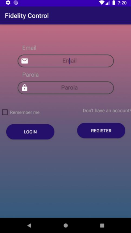
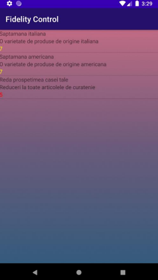
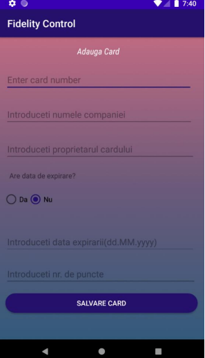
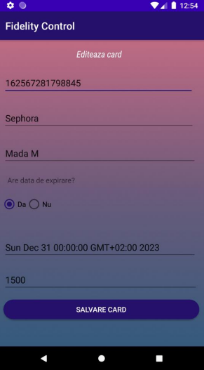
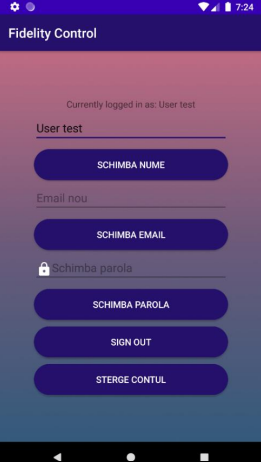
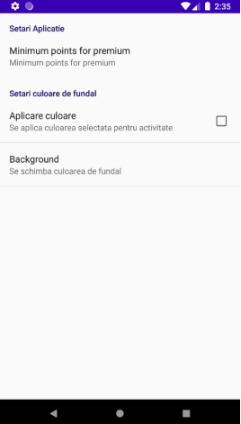
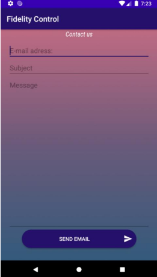

## Application for fidelity cards management
### The default page shows when the app opens with the options to login or register
             

### The list of available fidelity cards for the user, the menu with the options the user can use and the offers from the database
  
### The pages to add/edit a fidelity card
    
### The user account profile and settings pages
 
###  Contacting the developers and rating the app pages
 
